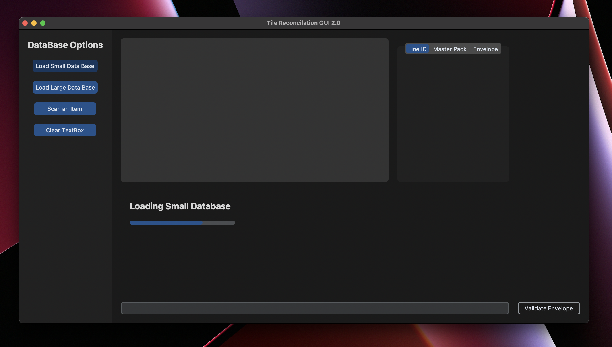
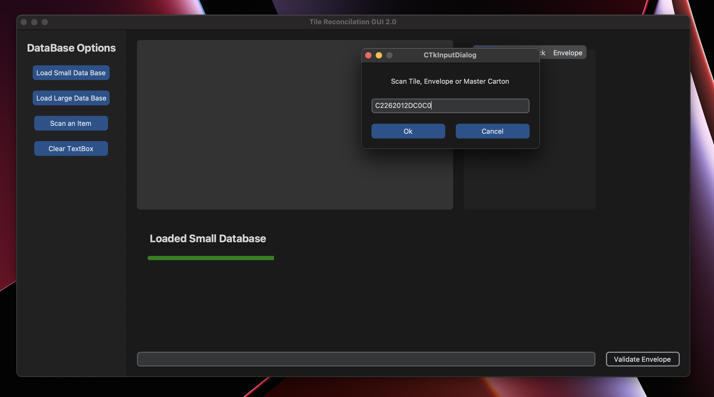
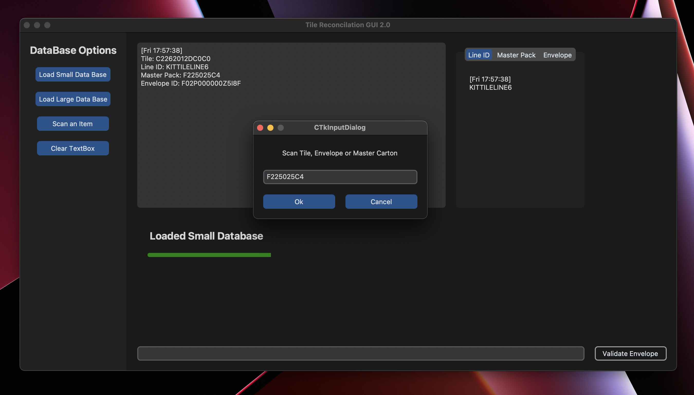
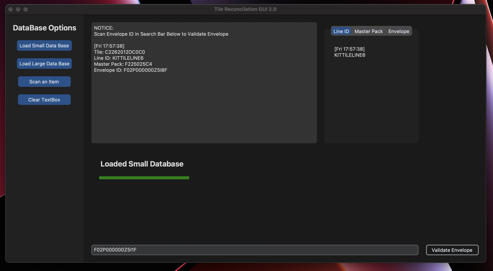
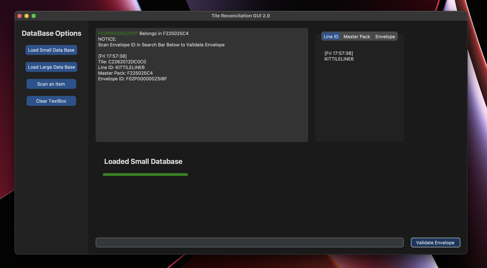
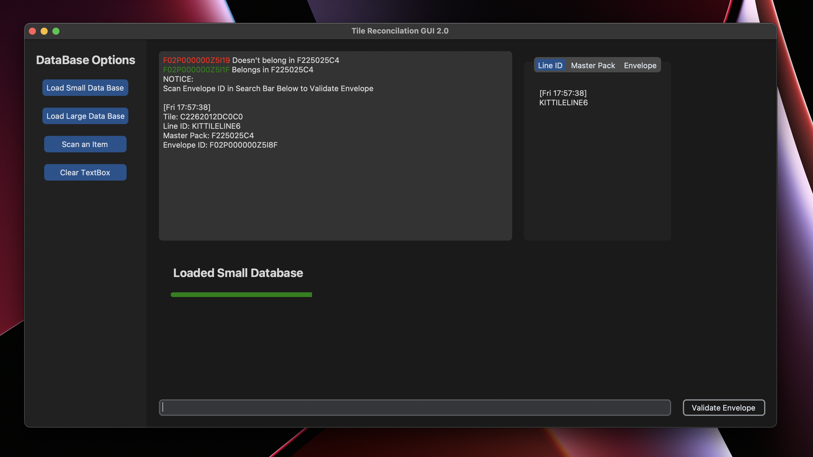

# Tile Reconcilation
A graphical user interface allowing on-site support and FSC operators the ability to perform a complete tile reconcilation within one applicaiton.
Funcitonality includes loading databases options, scan item options, and envelope validation funcitonality. Application has been tested to work with MacOS and Windows.


## Installation
Install the module with pip:
```
pip3 install customtkinter
```
```
pip3 install tk
```
```
pip3 install pandas
```
# Homescreen Interface

## Database Options
Load Small Database:   
- Pulls 5,000 entries from barcode_scan_events as well as mc_scan_events.   
Load Large Database:   
- Pulls 50,000 entries from barcode_scan_events as well as mc_scan_events.

## Scan an Item
- `Scan tile` device to find systematically correct envelope and master carton location.   
   
- `Scan envelope` to find systematically correct master carton location.   
   
- `Scan master` carton to begin envelope validation process.  
## Clear TextBox
- Clears textbox entries


# Order of Process
First, select a database, and wait for the loading to be finished

Second, select `Scan an Item`, and scan either a tile, envelope, or master carton

Information regarding the correct envelope and masterpack will be posted in the history text box.  
Scanning an envelope will have similar results.  
Scanning a Master Pack will begin a different functionality.  

# Master Pack Order of Process
After Scanning Master Carton ID, begin scanning envelopes inside that master carton in the search bar at the bottom.

Scan 1 envelope then press the `Validate Envelope` button at the bottom right.   
If the envelope id is green, then it belongs in the master carton.   
If the envelope id is red, then pull it from the master carton. 

`Invalid`

