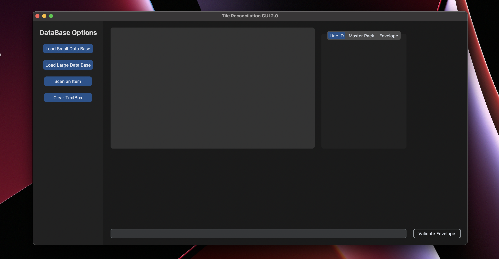

# Tile Reconcilation
A graphical user interface allowing on-site support and FSC operators the ability to perform a complete tile reconcilation within one applicaiton.
Funcitonality includes loading databases options, scan item options, and envelope validation funcitonality. Application has been tested to work with MacOS and Windows.


## Installation
Install the module with pip:
```
pip3 install customtkinter
```
```
pip3 install tk
```
```
pip3 install pandas
```


